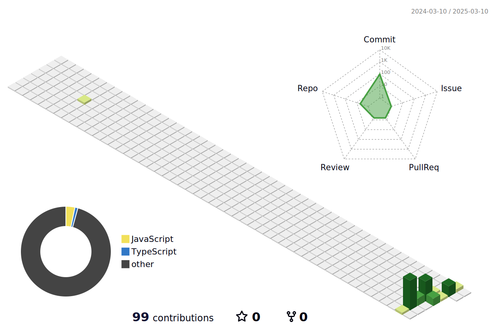

<div align="center">

  <!-- knock code pictures 敲代码的图片 -->
  <picture>
    <source media="(prefers-color-scheme: dark)" srcset="https://cdn.jsdelivr.net/gh/sun0225SUN/sun0225SUN/assets/images/coding.gif" />
    <source media="(prefers-color-scheme: light)" srcset="https://cdn.jsdelivr.net/gh/sun0225SUN/sun0225SUN/assets/images/developer.svg" height="225px" />
    
  </picture>

  <!-- for beauty 留个空行好看点 -->
  <div>&nbsp;</div>


<!-- profile logo 个人资料徽标 -->
  <div>
    
    &emsp;
    
    &emsp;
  </div>

</div>

# Hi there 👋 

**🤺 About Me**


 嗨，我是LunaZyd。热爱编程、读书、健身、摄影。
-   一个正在成长的菜鸟
 <p>&nbsp;</p>

## 📊 GitHub 数据统计


<!--START_SECTION:waka-->

```txt
Vue     0 hrs 13 mins   🟩🟩🟩🟩🟩🟩🟩🟩🟩🟨⬜⬜⬜⬜⬜⬜⬜⬜⬜⬜⬜⬜⬜⬜⬜   38.53 %
INI     0 hrs 8 mins    🟩🟩🟩🟩🟩🟩⬜⬜⬜⬜⬜⬜⬜⬜⬜⬜⬜⬜⬜⬜⬜⬜⬜⬜⬜   24.28 %
Java    0 hrs 7 mins    🟩🟩🟩🟩🟩🟨⬜⬜⬜⬜⬜⬜⬜⬜⬜⬜⬜⬜⬜⬜⬜⬜⬜⬜⬜   21.90 %
C++     0 hrs 4 mins    🟩🟩🟩🟨⬜⬜⬜⬜⬜⬜⬜⬜⬜⬜⬜⬜⬜⬜⬜⬜⬜⬜⬜⬜⬜   13.26 %
JAVA    0 hrs 0 mins    🟨⬜⬜⬜⬜⬜⬜⬜⬜⬜⬜⬜⬜⬜⬜⬜⬜⬜⬜⬜⬜⬜⬜⬜⬜   01.14 %
```
<!--END_SECTION:waka-->




<p align="center">

</p>
